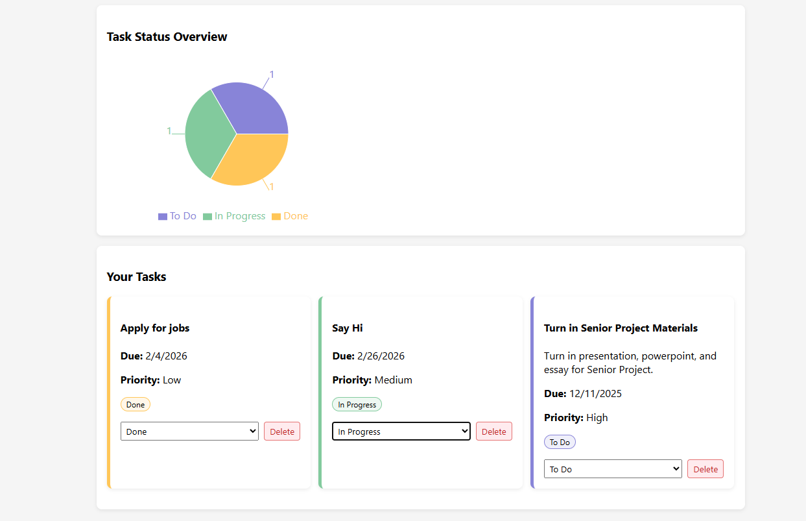

# Task Manager App

A full-stack productivity app for managing tasks with a Kanban-style workflow, priority levels, and visual progress tracking.



## Live Demo
WIP

## Tech Stack

**Frontend:** React, Recharts, Axios  
**Backend:** Node.js, Express  
**Database:** MongoDB Atlas  
**Auth:** JWT, bcrypt  

## Features

- User registration and login with JWT authentication
- Create, update, and delete tasks
- Set priority levels (Low, Medium, High)
- Track task status (To Do, In Progress, Done)
- Kanban-style status updates
- Pie chart visualization of task progress
- Responsive layout

## Getting Started

### Prerequisites
- Node.js
- MongoDB Atlas account

### Backend Setup
```bash
cd backend
npm install
cp .env.example .env
# Add your MONGO_URI and JWT_SECRET to .env
npm run dev
```

### Frontend Setup
```bash
cd frontend
npm install
npm start
```

Frontend runs on http://localhost:3000  
Backend runs on http://localhost:5000

## Project Structure
```
task-manager-app/
├── backend/
│   ├── config/        # Database connection
│   ├── controllers/   # Route logic
│   ├── middleware/    # JWT auth middleware
│   ├── models/        # Mongoose schemas
│   └── routes/        # API endpoints
└── frontend/
    └── src/
        ├── components/ # React components
        └── styles/     # CSS
```

## API Endpoints

| Method | Endpoint | Description | Auth |
|--------|----------|-------------|------|
| POST | /api/auth/register | Register user | No |
| POST | /api/auth/login | Login user | No |
| GET | /api/tasks | Get all tasks | Yes |
| POST | /api/tasks | Create task | Yes |
| PUT | /api/tasks/:id | Update task | Yes |
| DELETE | /api/tasks/:id | Delete task | Yes |

## Author
Jackson Elliott — CS Senior, Palm Beach Atlantic University
